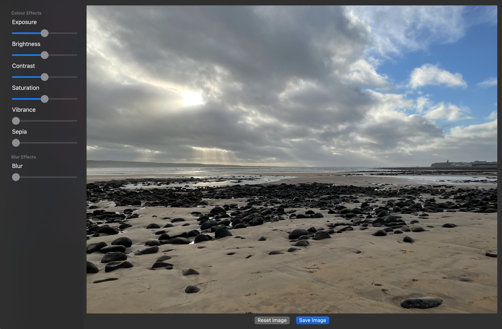

# Image Editor

This is a personal project to explore building an image editor using SwiftUI, CoreImage, and Metal Performance Shaders.

Currently you can:
- Import files from your photos and local files
- Apply filters and effects for exposure, brightness, saturation, blur, and more.
- Export your edited file locally in PNG, JPEG, HEIC, and OpenEXR formats

The app currently works on Mac, iOS, and iPad, but the UI is definitely tailored towards Mac at the moment!

The user interface is mainly built using SwiftUI, with a custom Metal view to handle the image processing. The main rendering code is based off the example provided by apple here: https://developer.apple.com/documentation/coreimage/generating_an_animation_with_a_core_image_render_destination, but is quite heavily modified to use Metal Performance Shaders instead of CoreImage. Partially for performance, but also for me to get an idea of how shaders work. I've found that the default example has some performance issues when being adapted for image processing - CoreImage was slowing down when trying to scale large images down to a device before applying effects (even using the built in scaling filter), while directly using Metal seems to work better.

That said, there's a lot more manual handling in terms of resources, pipelines, and ensuring compatibility across devices. SwiftUI integration also has some awkward interactions, especially when it comes to holding on to state and references to textures and other resources that need to be cached.

The chunk of the image processing is located in the `MetalRenderer.swift` and `MetalResourceProvider.swift` files. I've tried to migrate the processing code to be shared between the rendering process and the file saving process to guarantee accuracy, and passing a reference to a target texture (when rendering this will be the metal view texture, when saving a file I'm using an intermediary texture sized to the image dimensions). The 'saving' process is currently using CoreImage under the hood since there are convenience functions for encoding data from a texture into the major file formats. You can initialize a CIImage instance from a metal texture, so we can take the output texture and the CoreImage will do the rest.

There's a bunch of improvements to be made in terms of adding more filters, tailoring the UI for each platform, and refining the image processing to work better with different devices, but this is hopefully a good frame of reference for now.